<div align="center">



<a href="https://git.io/typing-svg">
  
</a>

<br/>


</div>

<div align="center">
  
</div>

```yaml
name: "Dhruvesh Dabhade"
age: 16
status: "16-Year-Old Developer"
based_in: "India"
focus:
  - Building full-stack web applications & AI/ML tools
  - Exploring machine learning, deep learning & LLM pipelines
  - Solving algorithmic problem-solving challenges
  - Contributing to open-source software
philosophy: "Learn relentlessly, code with curiosity, build with passion."
```

I'm a **16-year-old developer** from India with a deep passion for computer science, software engineering, and artificial intelligence. I enjoy building modern full-stack web applications, exploring machine learning models, and turning ideas into clean, functional code.

When I'm not coding, I spend my time mastering technologies like **Python**, **JavaScript/TypeScript**, **React/Next.js**, **Node.js**, and **FastAPI**, while diving into algorithms, system design fundamentals, and open-source projects.

**🎯 Open To**

<div align="center">


</div>

<div align="center">
  
</div>

**Languages**

<div align="center">

</div>

**Frontend**

<div align="center">

</div>

**Backend & Databases**

<div align="center">

</div>

**Cloud, DevOps & Tooling**

<div align="center">

</div>

<div align="center">
  
</div>

<div align="center">


</div>

<div align="center">
  
</div>

<details>
<summary><b>🛠️ EnvMan — CLI Environment Variable & Secret Manager</b></summary>
<br/>

A fast, lightweight CLI tool engineered for securely managing, encrypting, and syncing `.env` configuration files across development environments.

| Attribute | Detail |
|---|---|
| **Stack** | Rust, CLI (Clap), AES-256-GCM, Docker |
| **Features** | Encrypted config storage, environment diffing & instant sync |
| **Repository** | [github.com/dhruvesh07/envman](https://github.com/dhruvesh07/envman) |

Designed to streamline local development workflows, EnvMan prevents credential leakage by keeping sensitive environment variables encrypted at rest with zero external runtime dependencies.

</details>

<details>
<summary><b>⚡ Synco — Low-Latency Real-Time State & Data Sync Engine</b></summary>
<br/>

A high-performance peer-to-peer and cloud data synchronization engine supporting real-time state updates across web applications.

| Attribute | Detail |
|---|---|
| **Stack** | TypeScript, Node.js, WebSockets, Redis, SQLite |
| **Features** | Delta state synchronization, bi-directional event streams |
| **Repository** | [github.com/dhruvesh07/synco](https://github.com/dhruvesh07/synco) |

Synco handles low-latency multi-client state syncing with automatic reconnect resolution, conflict handling, and lightweight WebSocket event broadcasting.

</details>

<details>
<summary><b>🧠 Core OS — Lightweight x86 Kernel & System Simulator</b></summary>
<br/>

An educational operating system kernel built from scratch to explore low-level systems programming, memory management, and hardware interactions.

| Attribute | Detail |
|---|---|
| **Stack** | C, Assembly (x86), QEMU, Makefile, GDB |
| **Features** | Custom bootloader, memory paging, VGA text driver, basic shell |
| **Repository** | [github.com/dhruvesh07/core-os](https://github.com/dhruvesh07/core-os) |

A hands-on systems project implementing low-level OS components including interrupt descriptor tables (IDT), basic paging, keyboard interrupt handling, and a custom CLI command shell.

</details>

<div align="center">
  
</div>

<div align="center">


</div>

<div align="center">

</div>

<div align="center">
  
</div>

<div align="center">

<a href="mailto:dabhadedhruvesh007@gmail.com">
  
</a>
<a href="https://linkedin.com/in/dhruvesh07">
  
</a>
<a href="https://github.com/dhruvesh07">
  
</a>
<a href="http://dhruvex.wuaze.com">
  
</a>
<a href="https://leetcode.com/dhruvesh07">
  
</a>
<a href="https://geeksforgeeks.org/user/dhruvesh07">
  
</a>

</div>

<br/>

<div align="center">


</div>
